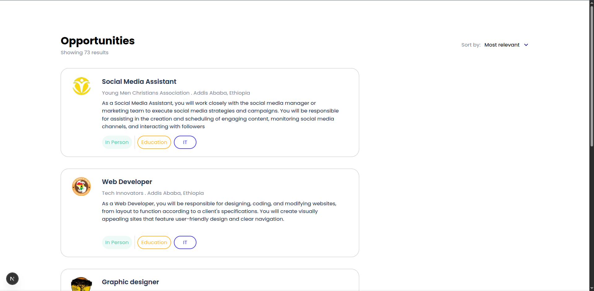
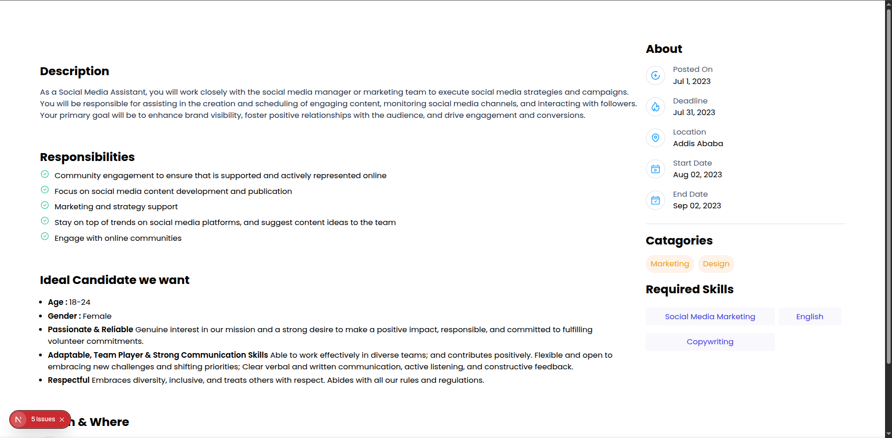

# Job Listing Web

A modern web application built with **Next.js**, **TypeScript**, and **Tailwind CSS** to showcase and manage job listings.

## 🚀 Features

- Browse available job listings
- Responsive UI with Tailwind CSS
- TypeScript support for type safety
- Next.js for fast performance and SEO
- Configured with ESLint and PostCSS

## 🖼️ Screenshots

### Homepage




### Job Details


_(Add your screenshots inside `public/screenshots/` folder and update the paths accordingly.)_

## 🛠️ Tech Stack

- [Next.js](https://nextjs.org/)
- [TypeScript](https://www.typescriptlang.org/)
- [Tailwind CSS](https://tailwindcss.com/)
- [PostCSS](https://postcss.org/)

## 📦 Getting Started

Clone the repository:

```bash
git clone https://github.com/Kalx6/Job_listing_web.git
cd Job_listing_web
```
